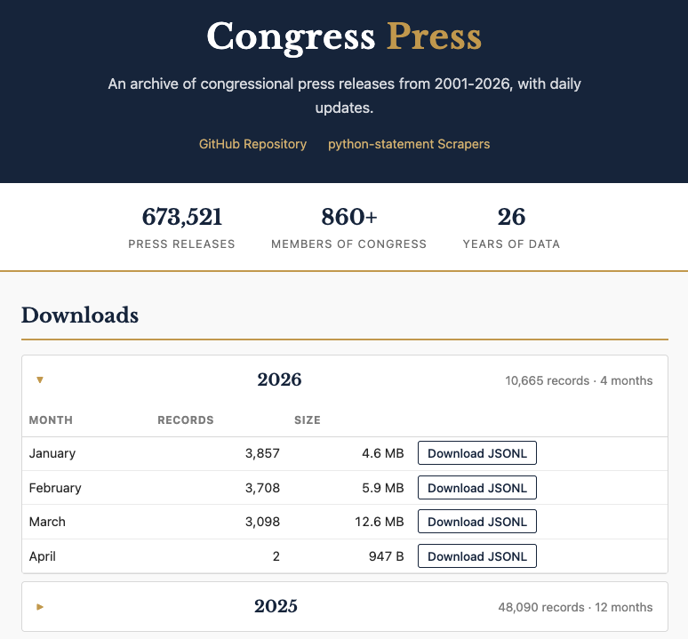
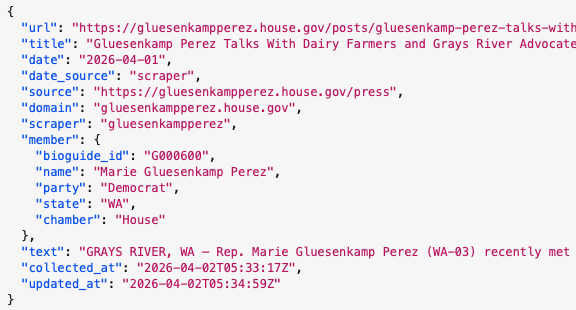

I began collecting congressional press releases more than a dozen years ago for the reasons I usually start collecting anything: I was interested in them and there wasn't a freely-available dataset I could find.

At the time, I was writing code in Ruby since I was working at The New York Times, and so the library to scrape those releases, called [Statement](https://github.com/TheUpshot/statement), was in that language. Writing scrapers in any language is mostly an exercise in frustration, but I actually enjoyed building Statement more than most things because [writing Ruby is fun](https://maori.geek.nz/what-is-ruby-it-is-fun-and-makes-you-happy-337b6f10fa40). I wish I did it more.

The problem was, as often is the case with this kind of project, the maintenance. As a former congressional reporter, I expected that most lawmaker websites were as unchanging as the institution itself, but it turns out that congressional offices love to redesign their sites, switch out their CMS and otherwise make life difficult for people who rely on the consistency of their web efforts. I'm a big Article I fan, but the pace of congressional website changes should be unconstitutional.

The result of that churn is that Statement would stop working or just return no releases for certain lawmakers, and then new ones would come along and have to be added. The good news is that the House, in particular, began to consolidate on only a few content management systems, making that maintenance job easier. The bad news is that if an office had some extra money in the budget or the member was in a leadership position, they could pay for a bespoke website experience. Usually JavaScript-driven.

I got some more time to work on Statement when those [press releases became part of the ProPublica Congress API in 2017](https://www.propublica.org/nerds/new-in-the-congress-api-congressional-statements-and-more). Even so, it was the rare period when I had complete coverage of press releases. In the announcement, I literally wrote "If you see that we're missing member statements for more than a few days, please email us."

Turns out that having those statements was useful; news organizations like the [LA Times](https://www.latimes.com/projects/la-na-pol-senators-trump-russia/) used them to help make sense of what a delegation was talking about, and political scientists interested in the shifting congressional rhetoric regularly emailed me to ask for the data. Behind the scenes, we collected the full text of the releases as best we could, but didn't publish it in the API. We did give it away when asked, though.

When I left ProPublica in 2021, we had lots of discussions about what should happen to the API. For a while it continued to chug along, but my updates to the scraping library were few and far between. But the interest from users didn't really fade, so I've long thought about how to actually make the collection and distribution process work. ProPublica was kind enough to let me take some of the congressional data assets with me, and now I'm pleased to announce that I've got both a more robust scraping system and bulk downloads of all of the releases I've been able to collect over the years. I call it [Congress Press](https://thescoop.org/congress-press/).

```{r, echo=FALSE, out.width="600px"}

```

Here's what you get: for the current year, there are monthly downloads of JSONL files that include the full text. In addition, each release has information about the member, including the unique Bioguide id, party, state and chamber. Here's a glimpse of what that looks like in the data:

```{r, echo=FALSE, out.width="600px"}

```

The code and data behind Congress Press are [on GitHub](https://github.com/dwillis/congress-press), and if you have feature requests or fixes, you can create issues there for me to respond to. Once a day, the collection is updated and the download site is rebuilt using GitHub Pages.

The scrapers are now completely re-written in Python, creatively called [python-statement](https://github.com/dwillis/python-statement). To help make it slightly more maintainable, I've switched from writing dozens of individual scrapers to a configuration-based system that includes the most common website layouts, plus the truly unique sites out there. Each morning, GitHub Actions tests out a bunch of scrapers to see how they are working, and [there's a dashboard](https://thescoop.org/python-statement/) for monitoring the results. I can tweak things so that it runs the full set of scrapers, too.

What makes this work are the regularly-updated [list of current lawmakers from the United States Project](https://github.com/unitedstates/congress-legislators/) on GitHub (which I contribute to) and Claude Code. There are many, many problematic uses of Large Language Models out there. Writing scrapers is not one of them. Of course, I've gotten better results on this project because I've written a lot of congressional press release scrapers before. So while I checked some of the code that Claude Code generated, I mostly checked the output, and I definitely found a few issues! But those issues were fixable. Both codebases are much better organized and more consistent than my usual programming habits would produce. It is still possible that some number of these scrapers have errors in some small way, although that dashboard would help me see those faster. But that's a trade-off I'm willing to make in this case. It wouldn't make the same decision in every instance.

My hope for this collection of press releases is that people use it to better understand how lawmakers communicate. I've got some ideas on how to do that, but I'm most excited to finally be able to say that, after more than 10 years of trying, I finally have the dataset I set out to build.
