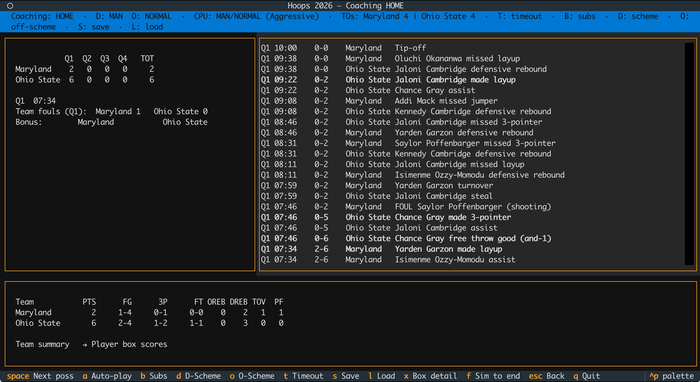
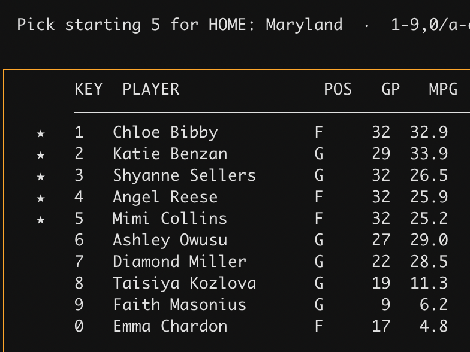

I first need to apologize to and thank a guy named Chuck Morris.

When we were students at the University of Pittsburgh in the previous century, Chuck and I had several things in common. We both worked at WPTS, the campus radio station. We both were geeks. And, perhaps most unusually given those two factors, we liked sports. OK, we loved sports, and in particular, basketball.

I can't remember exactly when I first learned about a PC game called "[Hoops](https://en.wikipedia.org/wiki/Hoops_(1986_video_game))", but once I did I ordered it and several 3.5-inch floppy disks arrived in the mail, ready for use in my IBM PS/2. That was the first computer I owned, and for the price of $3,200 I got a black and white text screen and 20MB of hard drive space. Hoops was exactly the kind of game that computer was built to run: a black-and-white, text-based game where you could "coach" a team against the computer or an opponent.

Hoops was released while I was still in high school, but I don't think I knew about it until college. I certainly hadn't read the 1987 Sports Illustrated story entitled ["Warning: Hoops May Be Addictive"](https://web.archive.org/web/20201116012050/https://vault.si.com/vault/1987/03/30/warning-hoops-may-be-addictive), but it wasn't long until I readily agreed with the assessment. I'm not sure if Chuck was as addicted as I was - he probably wasn't, being far more reasonable than I was - but we spent a lot of time in my dorm room playing that game.

Here's how it works, basically: you pick two men's college basketball teams - the earliest one available was from 1939, I think? - then select the lineups, choose your offensive and defensive strategies. Then you start the game. On the PC appeared lines of basic play-by-play, with commentary like "Jordan drives and stuffs." Players turned the ball over, picked up fouls and assisted on baskets. You could substitute at dead balls, call timeout and change your offense and defense in multiple ways. It was my favorite game.

Unless, of course, I lost, particularly on a last-second shot. The game did not supply emotion - there was no crowd noise, for example - so we readily supplied our own coaching frustrations. This is what I owe the apology to Chuck for. Took me too long to be a good loser. Chuck, being the stand-up guy he was, mostly remained silent. Sometimes he even commiserated with me. Chuck, I'm sorry I was an asshole. I hope you can forgive me, or that you've forgotten about all of this. Clearly I haven't.

For a long time, I hoped that someone might rebuild or update Hoops, but in many ways the world has passed it by. It is a command-line game in a world of flashy user interfaces, a text-based game in a video era. Nobody was going to bring it back to life, not like it was. So I, with the copious assistance of Claude Code, did. With a twist. Introducing [Hoops, the women's version](https://github.com/dwillis/hoops-game).

```{r, echo=FALSE, out.width="100%"}

```

This fall will mark 10 years since I first bought season tickets to the University of Maryland women's basketball team. At the time, I was looking for something to do with our kid that was fun, and watching the Terps - one of the nation's better teams - fit the bill nicely. I hadn't been a big women's basketball fan before, but basketball is basketball, and the atmosphere at the games was much more family friendly, in that we could talk about the games and kids got decent access to the players as they ran into the tunnels at halftime and at the end of games. Brenda Frese's Terps played fast, hard and they won. It was good entertainment.

Similar to my initial journey into Big East men's basketball in high school and college, I got hooked quickly, and now I can proudly say that while I have a passing knowledge of current men's basketball, I definitely know my stuff on the women's side. It's also true, however, that until recently, the women's game has gotten much less attention than the men's. As a Pitt grad, I knew a lot more about DeJuan Blair than, say, Maya Moore, even though the latter is a Hall of Fame-caliber player. The past several years has closed that gap somewhat, but it's hard to say that things are parity when a fairly successful Maryland team last season drew far fewer fans than perhaps the worst Maryland men's team in decades.

AI couldn't fix what was wrong with the Terps last season, but having worked with AI coding agents for a bit, I was convinced that I could have them rewrite the Hoops game I loved. If I could find it. I turned over all of the places I stored old computer stuff (I have quite a few, to my wife's chagrin) but only found a couple of unrelated 3.5" floppy disks. Surely, I figured, the actual code for the game must be available online. Someone smarter than me must have saved a copy on some archive site, right?

If so, I haven't found it. The original game was created and marketed before the Web was a thing, and it doesn't seem to have ever had a dedicated website. There are mentions here and there, but no source code. My idea - that I would have Claude Code read the original source and adapt it - was looking very unlikely. Gathering up what descriptions I had found and my memories of the game, I decided to try and build it from scratch.

Well, not exactly from scratch, since Claude's training material included some of the same descriptions of the original game that I had, and possibly more. I knew that I wanted to use Python to do this because I'm more familiar with that language. Creating a text-based game was easy; there are plenty of good libraries for doing that. The difference between building Hoops then and now is that today we have access to a lot more player-specific data and storage is less of an issue. The original game had to exist on at most several 3.5" floppy disks, and that's not the case with this remake, which weighs in at a fairly hefty 150MB.

What makes this possible is the data provided through the [wehoop](https://wehoop.sportsdataverse.org/) platform, including player averages and play-by-play data.

I don't know exactly how the original game handled possession outcomes, but it seems likely that it used team aggregates and then did probability draws against them. That's what my version does. After each possession resolves (turnover, made shot, missed shot with rebound), that resolution is assigned to a specific on-court player using weighted random sampling. A shooter is chosen proportional to that player's historical FGA, a rebounder proportional to their rebounds, a fouler proportional to their foul rate.

Here's the sequence that the game goes through on each possession:

1. Clock: Sample a possession duration from a triangular distribution centered on the team's pace-derived mean. End-of-quarter timing adjustments (two-for-one, hold-for-last) modify this.
2. Turnover check: Roll against the adjusted turnover rate. If it hits, possession ends.
3. Shot attempt: Pick a zone (rim, mid-range, three-point) from the team's shot mix distribution. Roll against that zone's eFG%.
4. Make/miss consequences: Makes score points and end the possession. Misses go to a rebound roll (offensive rebound rate). Shooting fouls send the team to the free throw line.
5. Free throws: Each FT is an independent [Bernoulli draw](https://en.wikipedia.org/wiki/Bernoulli_distribution) at the team's FT%.

An offensive rebound doesn't restart the possession process, which is a little bit of a fudge, but modeling out second-chance possessions would add another layer of complexity.

A close read of the previous paragraphs will tell you that individual players don't truly affect the simulation outcome. A team missing its best player still plays at its season-average rates. To be fair, the original Hoops had this problem as well. Players do get tired, and their performances degrade when they do, according to this formula:

```
effectiveness = 1 - 0.15 * fatigue^2
```

Player substitutions can only happen at dead balls - fouls, made baskets and timeouts - and follow the NCAA rules, including on subs in the final minute of game play.

Another thing about both versions is that players who are injured after playing only a few games are available but only for a few minutes - if a player appears in fewer than half of a team's games, the game caps their average minutes per game using the team's total games. Here's how that works using Maryland's Faith Masonius and Emma Chardon in the 2021-22 season. [Masonius averaged 22 minutes a game](https://herhoopstats.com/stats/ncaa/player/2022/natl/faith-masonius-stats-11e9ffdc-015b-0130-9486-12df17ae4e1e/) before tearing her ACL in the ninth game of the season. That's been reduced to 6.2 MPG in the game.

```{r, echo=FALSE}

```

The whole idea behind Hoops (old and new) is that it's the next best thing to actually coaching. Users can't talk to the refs (despite my best efforts in college) or make that impassioned half-time speech. But they can try to ride hot hands, switch up offensive and defensive tactics or call timeouts. Those changes, especially the offensive and defensive ones, can have small but meaningful impacts on games. Same with home court advantage, although the new Hoops offers the ability to play at neutral court venues, and even to run through a conference or NCAA tournament bracket.

When you play against the computer, you'll face one of three coaching "personalities", based on the team's stats: aggressive, conservative or balanced. An aggressive coach switches to a press earlier when trailing; a conservative coach tolerates more opponent scoring before changing schemes. The computer coach evaluates scheme changes at every dead ball using a rolling window of the last 10 possessions. The rules are heuristic:

* Opponent hitting threes? Switch to zone.
* Trailing big in the fourth quarter? Switch to press and hurry-up offense.
* Leading late? Slow down.
* Current defensive scheme being exploited? Switch to another.

Once a coach decides on a change, that lasts for at least six possessions to prevent chaotic swapping.

Right now the game provides access to teams from the 2015-16 season forward. Going back further is possible, although that season provides a clean cutoff in terms of using four 10-minute quarters instead of two 20-minute halves, and a fifth team foul in a quarter triggering two foul shots.

I've [released binaries](https://github.com/dwillis/hoops-game/releases) for Mac OS, Windows and Linux, or you can clone the repository and run it from there. Since this isn't a Mac App Store app, there are a couple of hurdles to overcome to run it on an Apple computer; check the [RUNNING.md document](https://github.com/dwillis/hoops-game/blob/main/RUNNING.md) for more details.

While a guide for how to behave when your team loses a tight game is not included (sorry again, Chuck), if you've got ideas for that or any other contributions to the game, I'd love to hear them. This is a nostalgic effort, for sure, but it's also a testament to a sport that I've come to love even more since those evenings sitting next to Chuck Morris, watching the seconds count down. Let's hoop.