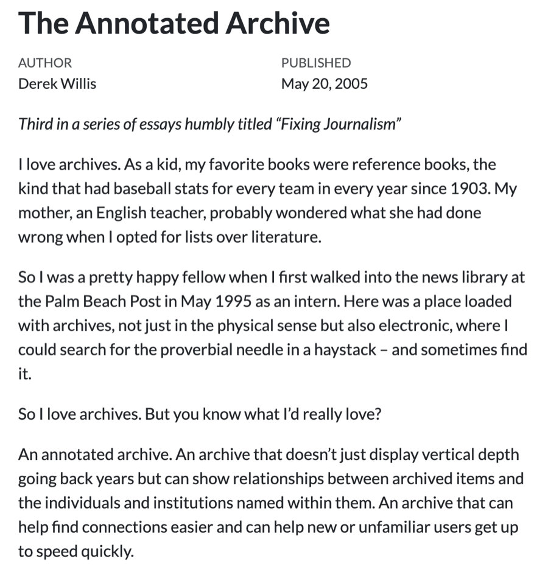
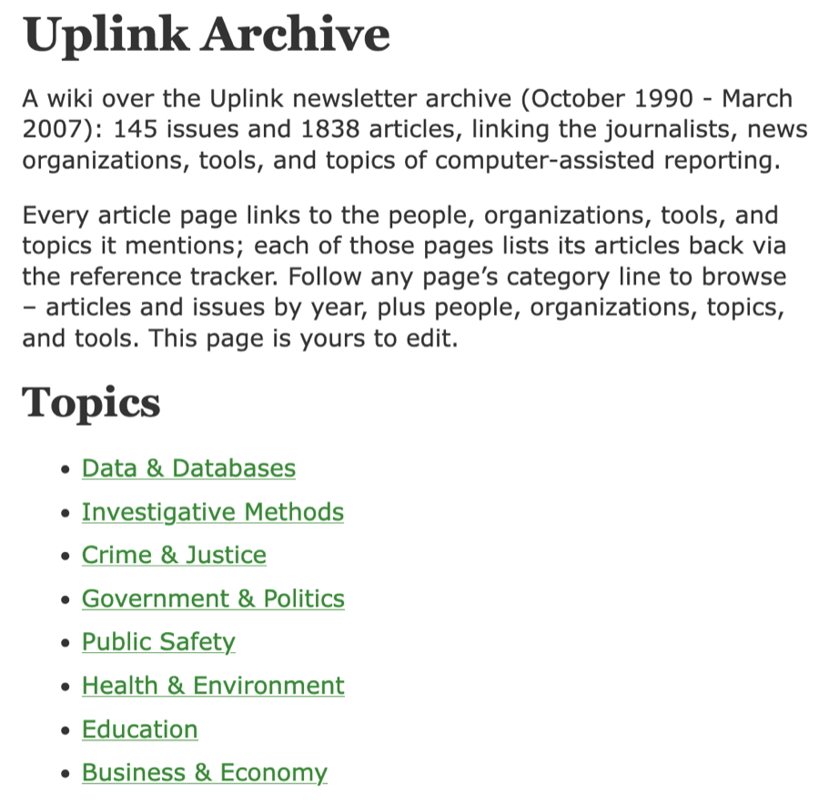
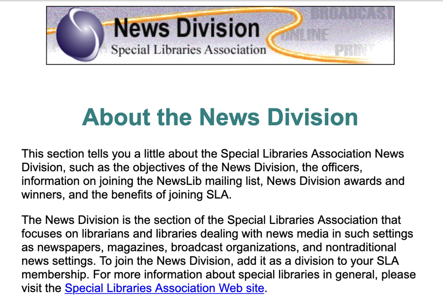
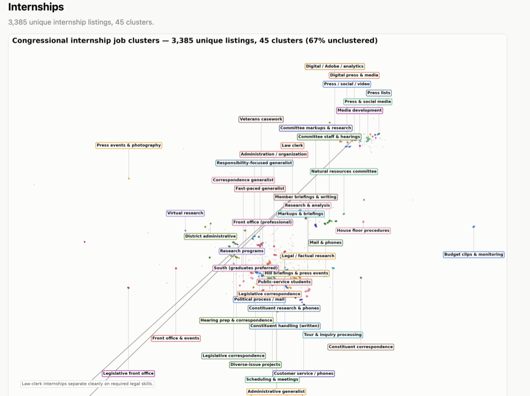
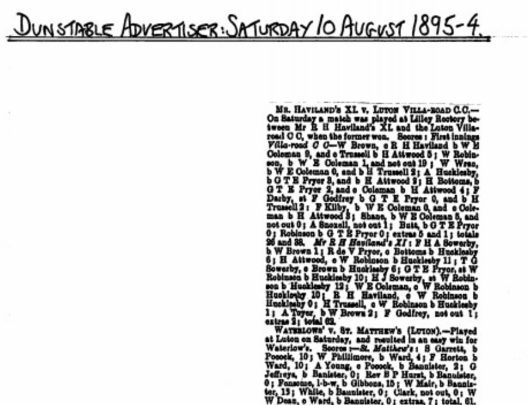
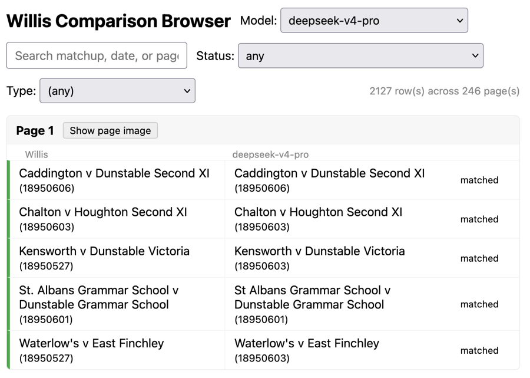
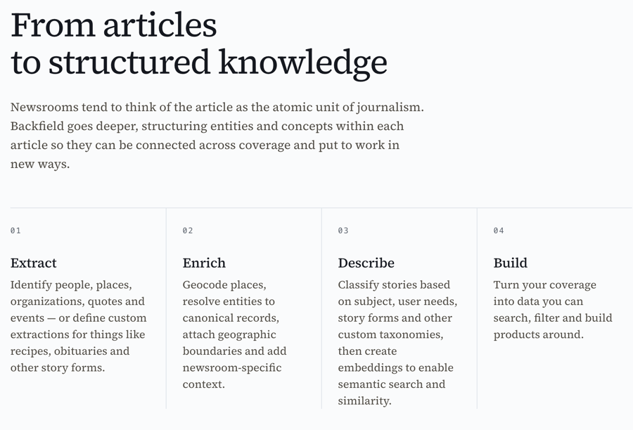

*I gave a short talk at [Computation + Journalism 2026](https://go.umd.edu/cplusjaa) at Northwestern on Oct. 3 called "The Annotated Archive, Revisited." It was 12 minutes, so this is the longer version.*

My first job in journalism was in a news library. That made a big impression on me, and I've been a little obsessed with archives ever since.

In 2005, everyone was talking about wikis. I was at The Washington Post, and I had an idea: take the stories we'd published and connect them the way wiki pages link to each other. I built a test case and wrote about it in a post called ["The Annotated Archive"](https://thescoop.org/thefix/the-annotated-archive/).

{width=450 fig-align="center"}

The reaction was friendly but skeptical. Turning an existing archive into a wiki was a lot of labor, and nobody had that kind of time.

It turns out that now it's not much labor at all. I have a small corpus of about 1,800 articles from [Uplink](https://github.com/dwillis/uplink), the old NICAR newsletter. I OCR'd them, then told Claude that I vaguely remembered the wiki software I used in 2005, a Ruby project called [Instiki](https://golem.ph.utexas.edu/wiki/instiki/show/HomePage). Find it if it still exists, I said, download the source, load the Uplink articles and make a wiki out of them.

And it mostly did. I smiled at that, and I was also a little alarmed. Like a lot of things models produce, it looks convincing at first glance.

{width=450 fig-align="center"}

## But the metadata

An archive you read one story at a time is a dresser drawer with a bunch of stuff crammed into it. A connected, annotated archive is something else, and the raw material for building one is metadata. Most news archives don't have much of it.

Models can close a lot of gaps. They can tell you what a story is about and whether it resembles another story. But the quality of metadata matters, and so do canonical lists of things: people, places, organizations. Leaving those decisions to a model is a bad place to be, even when the output arrives with the confidence of a middle-aged white guy like me.

Newsrooms used to have people whose job was to care about this. They were news librarians, and they were part of the larger world of special librarians: corporate libraries, military libraries, trade association libraries. I used to go to the Special Libraries Association conference and meet people who kept wonderfully weird collections.

{width=450 fig-align="center"}

The association still exists. Its late, great News Division doesn't. But we still need what those librarians did.

## Extract one good thing

I want to say that I'm a hypocrite on this. A lot of my own approach has been to throw material at a model, see what happens and declare victory. My collection of [U.S. House job and internship listings](https://github.com/dwillis/house-jobs) is an example. For more than a decade I've been receiving those listings from the U.S. House of Representatives by email, because I'm one of those people who keeps collections of things. My first question was simple: what skills do members of Congress say they want?

So I ran the listings through a clustering algorithm, or rather had Claude write the code to do that. The answer was that they want everything and also nothing. I could show the results to students, and they'd be impressed for about three seconds before asking what they were looking at.

{width=450 fig-align="center"}

Maybe members of Congress can't tell you what they want. But I can tell you that this data doesn't, and that's because I skipped a step. Instead of applying a model to everything at once, I should have picked one thing and extracted it as metadata, and then analyzed that. The lack of natural friction in LLMs works against us here. Journalists want it now. Good enough is good enough because there's always tomorrow. Librarians are good at pushing back on that, at telling you that you didn't actually know what you thought you knew.

## Cricket, OCR and evaluations

My other obsession of mine is old cricket coverage, and lately that's been [match reports from 1895 from minor counties matches in England](https://archive.acscricket.com/research/tw/tw_newspaper_cuttings_1895/index.html#zoom=z). A group of cricket historian friends and I are trying to index this material so it's findable. Not the full scorecards, just the basic fact that one club played another on a certain day in a certain year.

OCR complicates the process of extracting the necessary metadata, although it's better than it used to be. What I need are evaluations that compare what I produce as a human against what a model, in this case DeepSeek Pro 4.1, produces from the same page.

{width=450 fig-align="center"}

The models can mostly read the text. The problems are usually matters of style. Cricket people write "2nd XI" with Roman numerals; only weirdos spell out "Second Eleven." Ask a model without instructions and it will often spell it out. That's close to a match, but not a match, and it makes my job harder. So what I do is I label a set of the matches and then use that to judge the model's work.

{width=450 fig-align="center"}

With proper instructions, I've gotten various models up to about 90% agreement with my own work. That might be good enough for some journalism. It's not good enough for history yet.

The question isn't whether a model can do the task. It's whether we're giving it enough information and guidance to make success likely. I often just hope it works, and when it does, I congratulate myself on my brilliance.

## A plan, not a hope

If you have an archive or any collection of information that you've spent time with, you should already know what it should look like before you feed it to a model. That means you should have a metadata style guide and canonical lists. The style guide covers how you refer to things in the archive and which things matter more than others. The canonical lists are the entities you can't afford to get wrong.

For geography, that's a list of cities, districts or jurisdictions. For people, it starts with questions like: what's my style on middle names, and do I care about them? Is the group of people large enough that disambiguation will cause problems later? If you cover campaign finance, the answer is yes. At some level, that beat is mostly disambiguation.

## The start of a pipeline

Some people are working on this. My friend Chase Davis recently released [Backfield](https://localangle.co/blog/introducing-backfield/), a model-driven tool that takes your stories and does extraction, enrichment and classification. It's early days, and I recommend it. Chase's heart and head are in the right place.

{width=450 fig-align="center"}

But I don't think we can outsource metadata work and still expect to end up with unique information. We have to define what matters to us, how it should appear and how we'll use it. A model is often a good first step. It makes the archive less incoherent. Then we still need to apply human coherence and judgment. I'll like tools like Backfield even more when they let me drive more.

## Treat archives like we value them

Canonical data leads to better metadata. Better metadata, as any good librarian will tell you, leads to better outcomes: we know more, and we're more certain about what we know.

Almost everything a newsroom does connects in some way to its archive. Events that have truly never happened before are rarer than we like to pretend. If the archive can help with coverage, it should, but only if we impose some structure, order and priorities on it first. Right now most newsrooms treat the archive as the place where stories go after publication. We can do better than that, especially now that we have better tools to do it.
